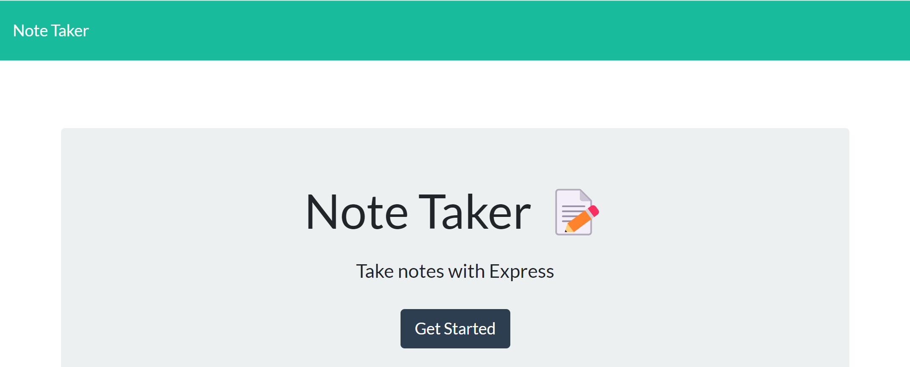
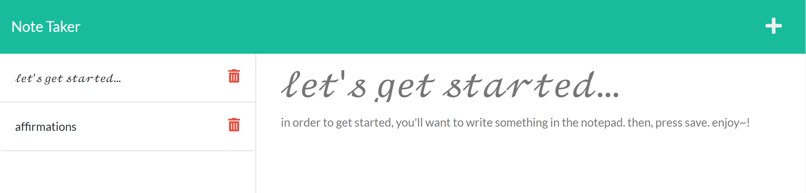

# **note-taker**

> This repository utilizes concepts within Express.js to create a digital note-taker application that saves data through POST routes and publishes them through GET routes. The deployed application can be accessed by [clicking here](https://fierce-river-42300.herokuapp.com/).

## **Table of Contents**

- [**note-taker**](#note-taker)
  - [**Table of Contents**](#table-of-contents)
  - [**Features**](#features)
  - [**Roadmap**](#roadmap)
  - [**Installation**](#installation)
  - [**Usage Instructions**](#usage-instructions)
  - [Questions](#questions)
  - [Credits](#credits)

## **Features**
The deployed application and repository contains the following back-end features. This project focuses more on back-end structures, to which these features highlight:

- Class instance model of notes to define functions that pertain to get and post routes. The class instance also defines three items for each note: the title, text, and an ID.
- Routes that connect front-end structures to back-end servers.
  - HTML routes direct user to the main page and load the appropriate HTML page.
  - API routes define get and post routes .
- Helper function to generated user IDs (UUID). 
- Server routes defined in server.js utilize either local port or server specified by .env files.

## **Roadmap**

The application could be improved by integrating the following:

- **Deleting Notes**: At the current moment, deleting notes is not a supported function. The routes for delete will need to be added.

## **Installation**

Copy the HTTPS or SSH key into your terminal and perform a git pull to create a local copy of the repository. A copy of this repository can be cloned using either of the following codes in the terminal to create a copy in your local environment:

**HTTPS**: 
> `https://github.com/christiangella/note-taker.git`

**SSH**:
> `git@github.com:christiangella/note-taker.git`

## **Usage Instructions**

The deployed application can be accessed by [clicking here](https://fierce-river-42300.herokuapp.com/).

To deploy the application from your local environment, first clone a copy of the repository. Once the repository has been downloaded, navigate to the repository in the terminal and install the necessary third-party packages using `npm i`. 

To deploy the application locally, run either `npm start` or `node server.js`. This will deploy the repository to your local host at http://localhost:3001/.

To deploy the application to Heroku, run `npm i heroku` in the terminal. Log into Heroku in the terminal using `heroku login`, then run the following commands: `git init` to initialize the repository, `git add .` to add the repository contents, and `git commit -m "{message}"` to commit the changes. If you have not created a Heroku application, run `heroku create`. Then run `git push heroku {branch}`.

## Questions

This repository was created by Manong Chris. For further support, reach out by email at christian.gella@gmail.com or by Github at christiangella.

## Credits

This repository was developed for the UC Davis Fullstacks Bootcamp under the UC Davis Continuing and Professional Education.
